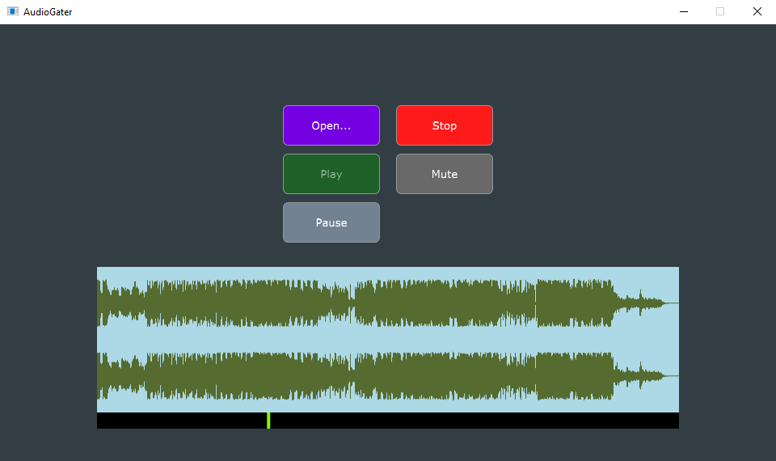

# AudioGater

This project serves as a learning ground for C++, Digital Signal Processing (DSP), and the JUCE framework. The foundation of the project is based on a JUCE tutorial about audio players, which you can find [here](https://docs.juce.com/master/tutorial_playing_sound_files.html).

The project is an audio application designed to playback selected audio tracks. When an input signal is detected on the device playing the audio track, the output currently playing will mute, facilitating input signal monitoring. In short, it's an automatic talk-back application.

_Image reflects current state_

## Table of Contents

- [Features](#features)
- [Requirements](#requirements)
- [How to Use](#how-to-use)

## Features

- **Automatic Talk-Back Functionality:** Mutes the playback of the selected audio track upon detecting an input signal. (The gating implementation is very basic and will be redone with ballistic filters)

- **Audio Track Playback with Transport:** Load, play, pause, resume and stop audio tracks.

- **Transport Bar:** Navigate through audio tracks with a responsive transport bar.

- **Track Details:** View the currently playing audio file details and informations. (To Be Added)

- **Input Signal Detection:** The application accurately detects input signals from connected devices such as microphones.

- **Mute and Unmute Controls:** Users can toggle output muting with a button.

- **Audio Format Support:** Currently supports MP3 and WAV. (More formats will be added later)

- **Configurable Thresholds:** Customize sensitivity thresholds for input signal detection. (To Be Added)

- **Configurable Attack and Release:** Customize attack and release times of the gating mechanism. (To Be Added)

- **Cross-Platform Compatibility:** Developed using the JUCE framework, ensuring seamless operation across Windows, macOS, and Linux.

## Requirements

- **C++ Development Environment:** You should have a working C++ development environment set up on your system.

- **JUCE Framework:** You will need to have JUCE installed on your system. You can download JUCE and find installation instructions on the [JUCE website](https://juce.com/download/).

- **JUCE Projucer:** The application is currently set up using the JUCE Projucer; later, it will be set up using CMake.

- **Audio Input Device:** To fully utilize the input signal monitoring feature, you'll need an audio input device (e.g., microphone) connected to your system.

- **Audio Track for Playback:** To utilize the playback functionalities, ensure you have an audio track in a supported format.

## How to Use

1. **Open the Project in Projucer:** Launch JUCE Projucer and navigate to the directory containing the AudioGater project. Open the project by selecting the appropriate `.jucer` file (e.g., `AudioGater.jucer`).

2. **Open Solution in Your IDE:** Inside Projucer, go to the "File" menu and choose "Open in IDE." This action generates the necessary project files for your development environment and opens the solution in your chosen C++ IDE.

3. **Compile and Run:** In your IDE, configure any necessary build settings or paths if needed. Then, initiate the compilation process to build the application. Once compiled successfully, you can run the application directly from your IDE.
